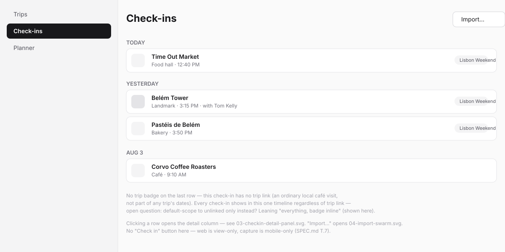
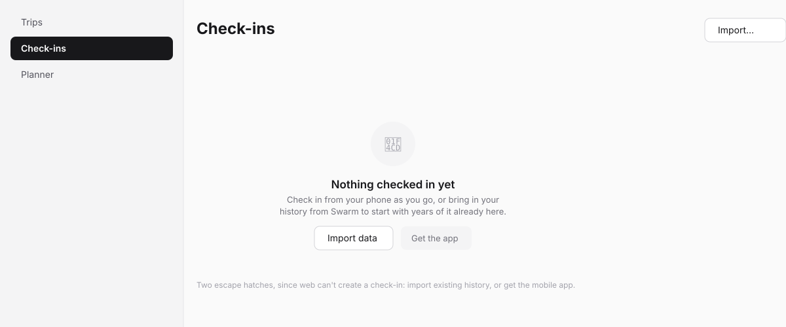
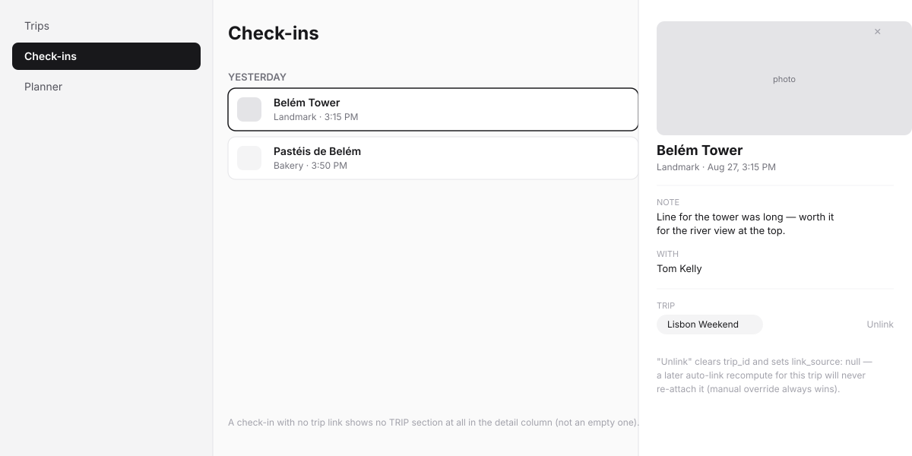
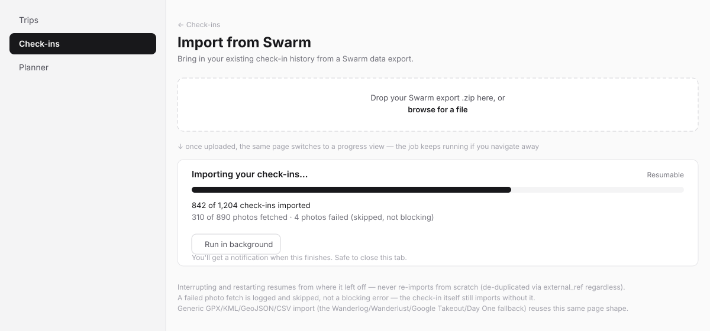

# Check-ins (web) — design spec

> Wireframe-before-build spec per the `sv-ui-design` workflow. Wireframes in
> [`web-checkins/`](web-checkins/). Kept inside the plugin (not the
> platform's `docs/adhoc/`) because this plugin is externally-maintained.
> Covers `SPEC.md`'s `T.6` (timeline & detail) and `T.8` (Swarm importer).

## Problem

The Check-ins screen is the read side of the log spine: everywhere the user
has checked in, browsable as one unified timeline, whether or not it's
attached to a trip. Web is deliberately **view-only** — live check-in
capture is a mobile-only surface (`T.7`, not designed in this pass) — so
this screen's two jobs are: let someone browse their history, and give
Swarm/generic-format import a real home.

## Direction

Reverse-chronological timeline, day-grouped, inside `ThreeColumnLayout`'s
main column; click a row to open the detail column. Import is a page of its
own (`/travellog/checkins/import`), not a dialog — a resumable background
job deserves a page you can navigate away from and back to, not a modal
that implies it blocks.

## Jargon table

| Internal              | User sees                                  |
| ----------------------- | --------------------------------------------- |
| `visit`                 | "check-in" (never "visit" in copy)          |
| `external_ref`          | (never shown — de-dup is invisible)          |
| `link_source`           | (never shown — "Unlink" is the only surfaced verb) |
| `travellog_import_jobs` | "Import" / "Importing your check-ins…"       |

## Screens

### 1. Check-ins, populated — `web-checkins/01-checkins-populated.svg`

- Day-grouped timeline ("Today", "Yesterday", then a plain date). Each row:
  a place-category glyph, name, category + time, and — only when linked —
  a trip-name badge. A check-in with no trip link shows no badge; this is
  not an error state, it's the common case for most day-to-day check-ins.
- "Import…" is a plain secondary button in the page header, not buried in a
  menu — it's the primary way this screen ever gets populated before mobile
  capture exists.

### 2. Check-ins, empty — `web-checkins/02-checkins-empty.svg`

Two actions, not one — `EmptyState` normally has a single primary action,
but this screen genuinely has two equally-valid next steps for a web-only
session: import existing history, or go capture one on the phone. Neither
is subordinate to the other.

### 3. Check-in detail panel — `web-checkins/03-checkin-detail-panel.svg`

Photo (if any), note, companions ("with"), and — only if linked — a trip
badge with an "Unlink" action. The TRIP section doesn't render at all for
an unlinked check-in (no empty placeholder row).

### 4. Swarm import — `web-checkins/04-import-swarm.svg`

Upload zone → the same page reflows into a progress card once a job starts:
progress bar, counts for both check-ins and photos (tracked separately,
since photo-fetch is the slower, failure-prone half), a "Run in background"
affordance, and an explicit "safe to close this tab" line — the job is a
real `sdk.jobs` background job, not something tied to the page staying
open. A failed photo is stated plainly as skipped, not hidden and not
treated as a hard error.

## States checklist

- **Empty:** screen 2.
- **Populated:** screen 1, including a row with no trip badge (unlinked)
  and one with a companion name in its subtitle.
- **Selected / detail:** screen 3, both the linked and unlinked variant
  (TRIP section present vs. absent).
- **Pending:** import's progress card (screen 4) — this is this screen's
  main "pending" state, and it's long-running rather than a spinner.
- **Error (expected):** a photo fetch failure surfaces inline in the
  progress card (screen 4), non-blocking; a malformed export file fails the
  upload step itself with an inline message before any job starts.
- **Error (unexpected):** plugin ships `app/error.tsx`.
- **Degraded:** n/a — `loading.tsx` gates the timeline's cold load.

## Engineering notes

- **DS gap check: no gap.** `ThreeColumnLayout`, `PageContainer`,
  `PageHeader`, `EmptyState`, `Badge`, `Button`. The progress bar in screen
  4 — check `packages/ui` for an existing progress/meter primitive before
  building one plugin-locally; if genuinely missing, that's a DS gap to
  raise, not a reason to hand-roll it here.
- **Timeline is a read-side projection**, per `CONCEPT.md` — the day
  grouping, trip badges, and any future map view are all computed from
  `visit` rows at read time, never separately stored, so imported history
  renders identically to live-captured check-ins.
- **Mobile:** not attempted in this pass. The eventual mobile timeline is
  likely a simplified version of screen 1 (see `CONCEPT.md`'s "Deferred,
  not yet planned"), not designed here.

## Open questions

Carried from `CONCEPT.md` — not resolved by this wireframe pass:

1. **Check-ins timeline scope (open question 4).** Screen 1 shows every
   check-in with an inline badge when linked (the "leaning" option). The
   alternative — default-scoping to unlinked check-ins only — would remove
   the badge from this screen's default view and add a filter to see
   trip-linked ones, a real layout change, not just a filter default.

## Phasing

Two roadmap tasks: `T.6` (screens 1–3) ships in Slice 1 before `T.8`
(screen 4) — the importer needs somewhere for imported data to visibly land
before it's worth building.
