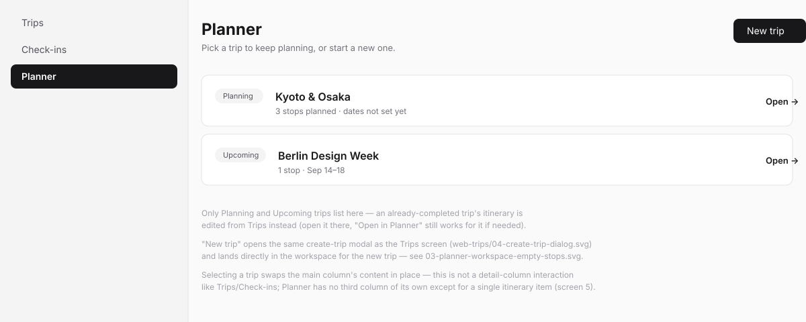
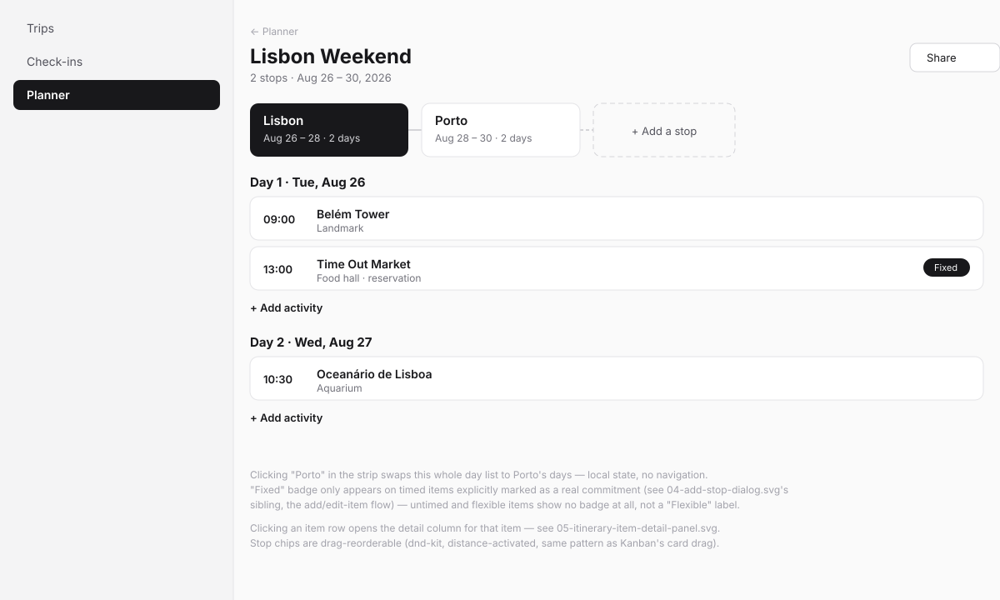
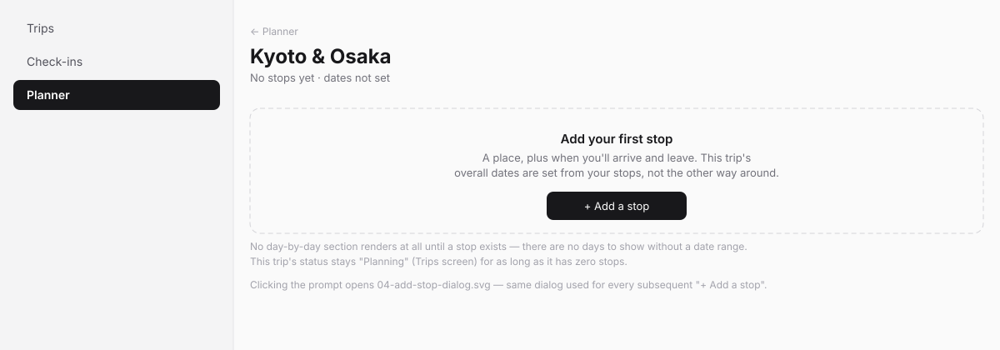
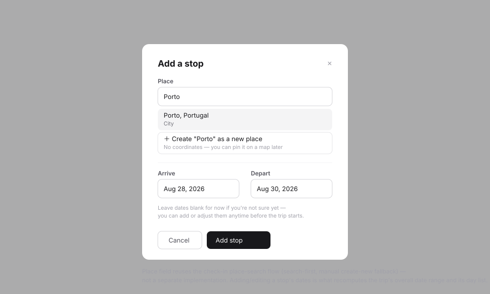
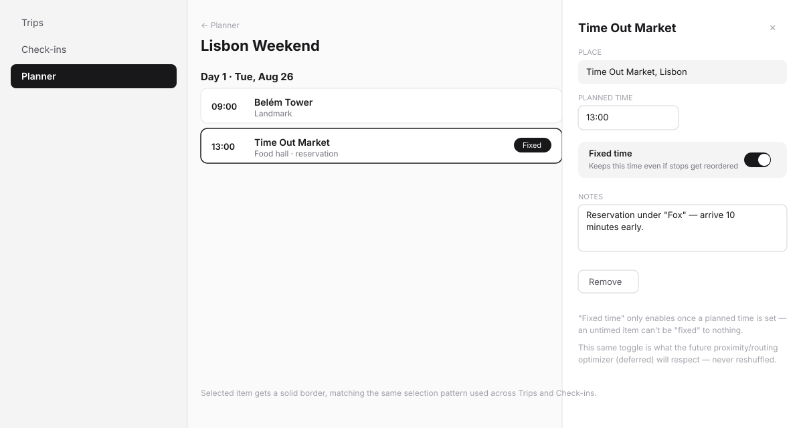

# Planner (web) — design spec

> Wireframe-before-build spec per the `sv-ui-design` workflow. Wireframes in
> [`web-planner/`](web-planner/). Kept inside the plugin (not the platform's
> `docs/adhoc/`) because this plugin is externally-maintained. Covers
> `SPEC.md`'s `T.15` (trip picker & stop workspace) and `T.16` (day-by-day
> itinerary editor).

## Problem

Planner is where a trip actually gets built: a starting point, then other
locations in between (each with its own dates — a "stop"), then a
day-by-day plan of what to do at each one. It's reachable either straight
from the sidebar (pick an in-progress trip, or start a new one) or from a
trip card on the Trips screen — both paths create/open the same trip, there
is exactly one create-trip action in this plugin.

## Direction

One workspace screen per trip, not a page per stop or a page per day: a
horizontal **stop timeline strip** (the route, in order) sits above a
**day-by-day itinerary** for whichever stop is currently selected in the
strip. Switching stops swaps the day list in place — no navigation, no
reload. The detail column is reserved for a single itinerary item's edit
view, not for a stop (a stop's own "detail" is just being selected in the
strip).

## Jargon table

| Internal                    | User sees                                   |
| ------------------------------ | ---------------------------------------------- |
| `travellog_stops`              | "stop" (kept as-is — plain English already, matches how Google Maps/Wanderlog describe a multi-city trip) |
| `arrive_date` / `depart_date`  | "Arrive" / "Depart"                          |
| `is_fixed`                     | "Fixed time" toggle, with a plain-language helper line — never the field name |
| computed trip status           | (not shown on this screen — see Trips)       |

## Screens

### 1. Planner, trip picker — `web-planner/01-planner-picker.svg`

Lists only `planning`/`upcoming` trips — an already-completed trip is
edited from Trips instead. "New trip" opens the same create-trip modal as
Trips (`web-trips/04-create-trip-dialog.svg`) and lands directly in screen
3 (a fresh trip has no stops yet).

### 2. Workspace, populated — `web-planner/02-planner-workspace-populated.svg`

- Stop strip: ordered chips (active stop filled/dark, others outlined),
  connected by a thin line reading top-to-bottom as a route, ending in a
  dashed "+ Add a stop" chip. Reorderable via drag (same distance-activated
  `dnd-kit` pattern as Kanban's card drag — click still opens/selects,
  drag still reorders, no separate handle).
- Day list for the active stop: each day is a date-labeled group of
  timed/untimed items; a **"Fixed"** badge appears only on items explicitly
  marked as a real commitment (see screen 5) — an ordinary flexible item
  shows no badge at all, not a muted "Flexible" one. This is deliberate:
  the unmarked default should read as unremarkable, not as a second status
  worth scanning for.
- "+ Add activity" per day, "+ Add a stop" in the strip — no global
  "add itinerary item" button floating disconnected from a day.

### 3. Workspace, no stops yet — `web-planner/03-planner-workspace-empty-stops.svg`

No day-by-day section renders at all — there's no date range to generate
days from. One clear prompt, one action. This is also what a freshly
created trip looks like the moment it's created.

### 4. Add stop dialog — `web-planner/04-add-stop-dialog.svg`

Place search (same search-first + manual-create-fallback flow as check-in,
not a separate implementation) plus arrive/depart dates — both **optional**
at creation time ("leave dates blank for now"), since the direction is to
let someone lay out a rough route before nailing dates. Adding or editing a
stop's dates is what recomputes the trip's overall date range and
regenerates its day list (`SPEC.md`'s `T.11`).

### 5. Itinerary item detail panel — `web-planner/05-itinerary-item-detail-panel.svg`

Place, planned time, the **Fixed time** toggle (disabled/hidden until a
time is set — an untimed item can't be "fixed" to nothing), notes, and
remove. The toggle's helper copy ("Keeps this time even if stops get
reordered") explains *why* in plain language rather than naming the future
optimizer feature it's actually protecting against.

## States checklist

- **Empty (no trips):** not this screen's job — see `web-trips.md` screen 2;
  Planner's own empty state is screen 1 with zero rows plus its "New trip"
  CTA, not illustrated separately (identical shape to a populated list with
  fewer rows).
- **Empty (trip, no stops):** screen 3.
- **Populated:** screen 2, including a stop with zero itinerary items on a
  given day (just the "+ Add activity" row, no item cards).
- **Selected / detail:** screen 5.
- **Pending:** dialog buttons flip to "Adding…"; item edits in the detail
  column save inline (no separate "Save" step needed beyond field commit —
  confirm this against `useCommitOnEnterOrBlur`'s pattern at build time).
- **Error (expected):** inline in the add-stop dialog (e.g. depart before
  arrive).
- **Error (unexpected):** plugin ships `app/error.tsx`.
- **Degraded:** n/a.

## Engineering notes

- **DS gap check: possible gap — flag before building.** The stop timeline
  strip (screen 2's horizontal connected-chip row) doesn't obviously map to
  an existing `@sovereignfs/ui` primitive. Check `packages/ui/src/components/`
  first per DS-first; if nothing fits, this is a real candidate for a new DS
  component (a horizontal step/route strip is generic enough to be useful
  elsewhere) rather than a plugin-local one-off — raise it as a design
  system proposal before `T.15` builds it locally.
- **The Fixed-time toggle is `Toggle`** (already in `@sovereignfs/ui` per
  this skill's component list) — no gap there.
- **Reuse, don't reinvent:** place search (screen 4) is the exact same
  component/flow as check-in's place search (`SPEC.md`'s `T.3`/`T.7`), and
  itinerary-item drag reorder should reuse the same position-and-dnd-kit
  approach already established for Kanban cards and Trips' stop strip —
  three call sites, one pattern.
- **Mobile:** not attempted in this pass. A stop strip and day list are
  plausibly a swipable-carousel shape on mobile (matching
  `SwipableMobileCarousel` precedent elsewhere in this platform), but that's
  a decision for the mobile UI pass, not assumed here.

## Open questions

Carried from `CONCEPT.md` — not resolved by this wireframe pass:

1. **Trip planning-status derivation (open question 3).** Screen 3's empty
   state description ("stays Planning for as long as it has zero stops")
   assumes the derived-status model from `web-trips.md`. If that resolves
   toward an explicit status instead, this screen's copy doesn't change but
   the status transition trigger does.
2. **"Stop" terminology (open question 8).** Used throughout these
   wireframes and this doc; open to a better word.

## Phasing

Two roadmap tasks: `T.15` (screens 1, 3, 4 — the picker and the stop
workspace shell) before `T.16` (screens 2, 5 — the day-by-day itinerary
editor and item detail), since the itinerary editor has nothing to render
until stops exist.
