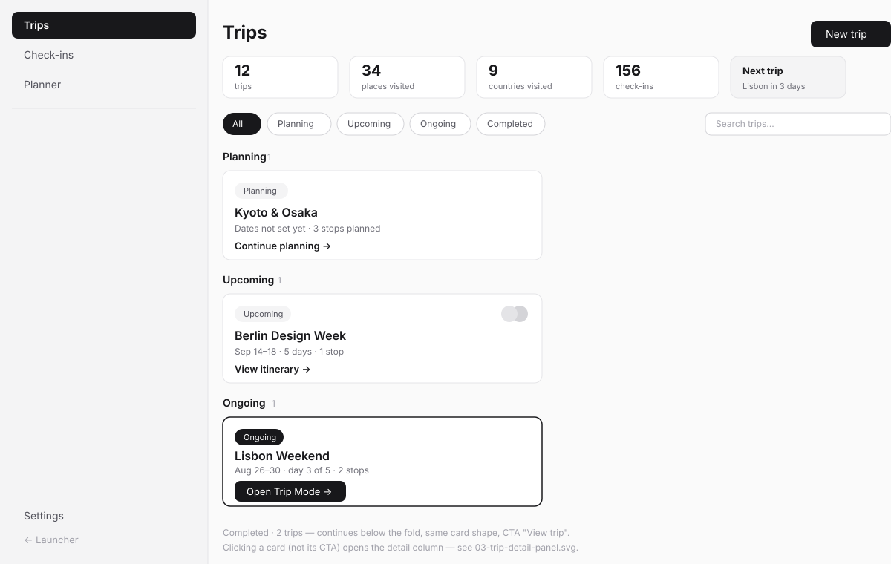
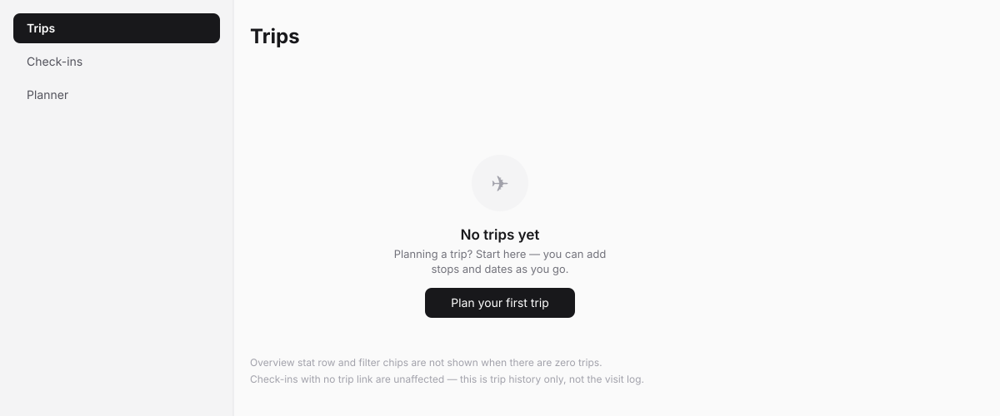
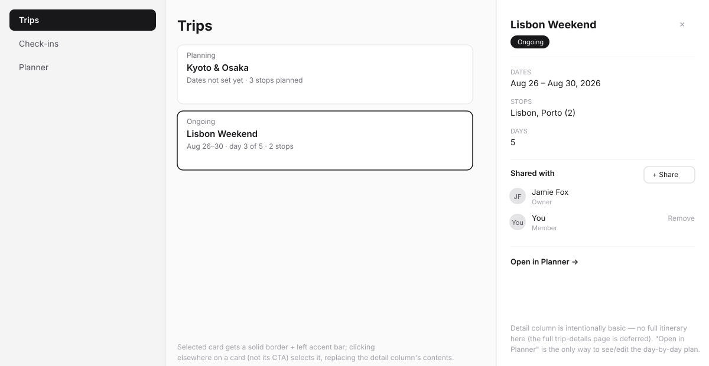
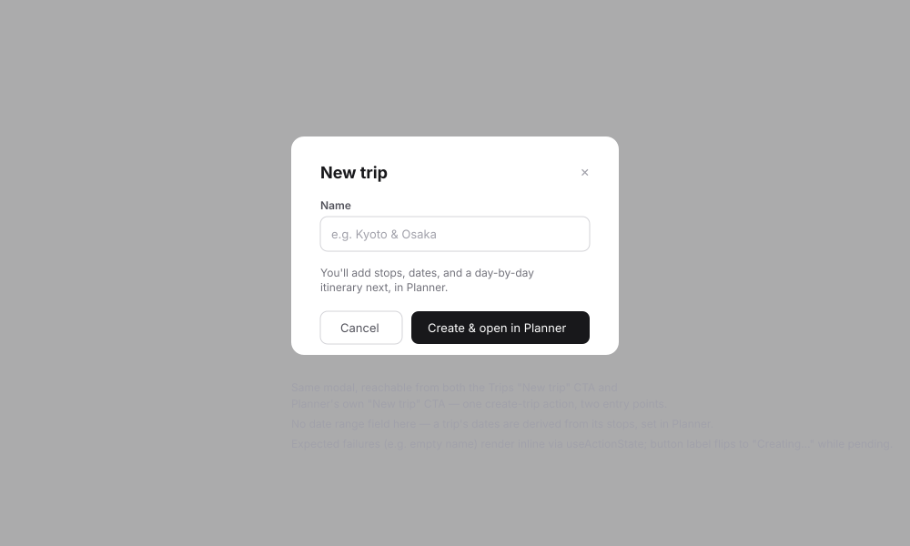
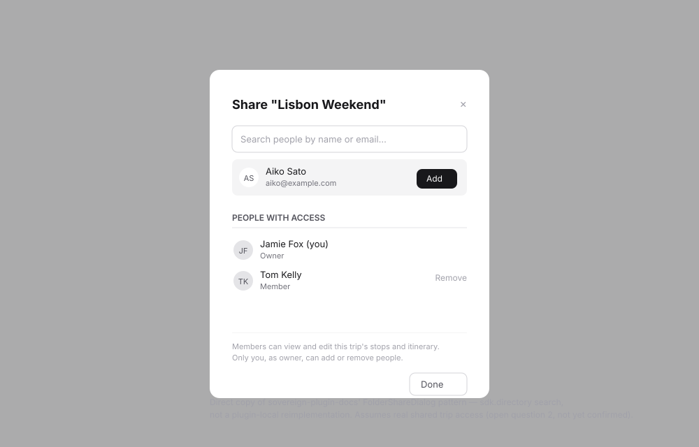
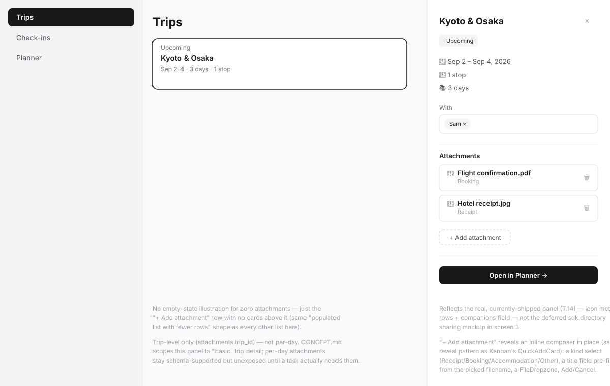

# Trips (web) — design spec

> Wireframe-before-build spec per the `sv-ui-design` workflow. Wireframes in
> [`web-trips/`](web-trips/). Kept inside the plugin (not the platform's
> `docs/adhoc/`) because this plugin is externally-maintained. Covers
> `SPEC.md`'s `T.13` (overview & cards), `T.14` (detail panel & sharing),
> and `T.17` (attachments, screen 6).

## Problem

The Trips screen is the browse/manage/share hub — the place to see every
trip at a glance (grouped by where it is in its life: planning, upcoming,
ongoing, completed), get an at-a-glance sense of overall travel history, and
manage who else can see or edit a trip. It is explicitly **not** where the
itinerary gets built (that's Planner) or where a trip's full detail lives
(that page is deferred — see "Open questions").

## Direction

`ThreeColumnLayout`: sidebar (Trips/Check-ins/Planner/Settings) + main
(overview stats, filters, status-grouped cards) + an optional detail column
that appears on card click. Status is always computed, never a field the
user sets. Sharing reuses `sovereign-plugin-docs`'s folder-sharing pattern
directly rather than inventing a new one.

## Jargon table

| Internal                      | User sees                                          |
| ------------------------------ | --------------------------------------------------- |
| `travellog_trips`              | "Trips" (never "plugin")                            |
| computed status enum           | plain badge text: Planning / Upcoming / Ongoing / Completed |
| `travellog_trip_members` role  | "Owner" / "Member"                                   |
| `owner_id`                     | (never shown directly — implied by "(you)" or the member list) |
| tenant                         | (never shown)                                        |

## Screens

### 1. Trips, populated — `web-trips/01-trips-populated.svg`

- Overview row: trip count, unique places, unique countries, total
  check-ins, and a "next trip" highlight tile (only rendered when a trip is
  upcoming or ongoing).
- Status filter chips (`All` active by default) + name search, both
  client-side over an already-fetched page — no server round trip per
  keystroke.
- Cards grouped by computed status, sorted by date within each group.
  Card CTA is status-dependent: **Continue planning** / **View itinerary** /
  **Open Trip Mode** / **View trip**. The Ongoing card gets a filled CTA
  button (it's the one action a user in the middle of a trip actually wants)
  — every other status uses a plain text link, deliberately less visually
  loud.
- Member avatars render on a card only when the trip has more than one
  member.

### 2. Trips, empty — `web-trips/02-trips-empty.svg`

`EmptyState` with one action ("Plan your first trip"). No stat row or
filter chips render with zero trips — nothing to filter.

### 3. Trip detail panel & sharing — `web-trips/03-trip-detail-panel.svg`

- Clicking a card (not its CTA) selects it — solid border replaces the
  default subtle one — and opens the detail column via `ThreeColumnLayout`'s
  conditional third child (local state, no route change).
- Detail column: status badge, dates/stops/days metadata, a "Shared with"
  list, and a single "Open in Planner" link — this is deliberately the
  extent of it. No itinerary preview, no planned-vs-actual comparison; both
  are deferred pending the full trip-details page.
- Main column narrows (`ThreeColumnLayout`'s default 360px detail width)
  when the column is open; cards that were a 2-up grid in screen 1 reflow to
  one per row.

### 4. Create trip dialog — `web-trips/04-create-trip-dialog.svg`

Name only — no date-range field. Submitting routes straight into Planner
for the new trip, since there's nothing else to do with a trip until stops
exist. Same dialog opens from Planner's own "New trip" CTA.

### 5. Trip share dialog — `web-trips/05-trip-share-dialog.svg`

Direct structural copy of `sovereign-plugin-docs`'s
`FolderShareButton`/`FolderShareDialog`: `sdk.directory` search, add,
current-members list with owner-only remove. **This entire screen is
contingent on open question 2 (below) resolving toward real shared access**
— if it resolves toward lightweight companion tags instead, this dialog
doesn't get built at all; a plain text field replaces it in screen 3.

### 6. Trip detail panel, attachments — `web-trips/06-trip-detail-attachments.svg`

`T.17`'s hardening-pass addition — `CONCEPT.md`'s Slice 2 scope names
"attachments (receipts, booking confirmations, accommodation details)"
explicitly, and `T.10`/`T.11` already built the full data layer (schema,
CRUD, authz, an upload route) with no web UI ever wired to it. Redrawn
against the panel's *actual* shipped layout (icon meta rows + a "With"
companions field, `T.14`'s real deviation from screen 3's `sdk.directory`
mockup), not screen 3's aspirational one.

- A plain list below "With": one row per attachment (kind icon, title,
  kind label, a trash icon to delete). No card/border treatment beyond a
  hairline — this is a utility list, not another set of clickable cards.
- "+ Add attachment" (dashed, same visual language as Planner's "+ Add a
  stop"/"+ Add activity" trailing affordances) reveals an inline composer
  in place — kind select, a title field pre-filled from the picked
  filename but editable, a `FileDropzone`, Add/Cancel. No dialog: the panel
  is already the "basic" surface `CONCEPT.md` calls for, and a dialog
  stacked on top of an already-narrow 360px column would feel heavier than
  the feature warrants.
- **Trip-level only** (`attachments.trip_id`, never `trip_day_id`) — the
  schema supports per-day attachments too, but neither `CONCEPT.md`'s Trips
  section nor its Planner section describes a per-day attachments UI, and
  building both doubles this task's scope for a case nobody's asked for
  yet. Stays schema-supported, exposed later if a real need shows up.

## States checklist

- **Empty:** screen 2.
- **Populated:** screen 1, including a trip with only one status group
  present (no "Ongoing" section header renders when nothing is ongoing —
  don't render an empty group header).
- **Selected / detail:** screen 3, extended by screen 6's attachments
  section — including its own empty state (zero attachments: just the
  "+ Add attachment" row, no list above it, same "populated list with
  fewer rows" shape every other list in this plugin uses).
- **Pending:** dialog buttons flip to "Creating…" / "Adding…"; card CTAs
  don't have a pending state of their own (they navigate, they don't
  mutate); the attachment composer's Add button flips to "Uploading…"
  during the two-step upload-then-create-row sequence.
- **Error (expected):** inline in dialogs (create-trip name validation,
  share-dialog "user not found"), input preserved; the attachment composer
  shows the upload route's or `createAttachmentAction`'s error inline and
  keeps the picked file so the user isn't forced to re-pick it.
- **Error (unexpected):** plugin ships `app/error.tsx`.
- **Degraded:** n/a for this screen — one data source, `loading.tsx` gates
  the cold-load skeleton. Attachments are fetched on demand when the detail
  column opens (same pattern as Check-ins' `getVisitDetailAction`), not
  bundled into the cards list fetch — a `loading` flag on the panel covers
  that window, not a route-level `loading.tsx`.

## Engineering notes

- **DS gap check: no gap.** Sidebar nav is plugin-local (same precedent as
  Kanban's and Docs' own sidebars). Everything else consumes
  `@sovereignfs/ui`: `ThreeColumnLayout`, `PageContainer`, `PageHeader`,
  `Dialog`, `Badge`, `EmptyState`, `Button`, `Input`, `Avatar`,
  `ConfirmDialog` (for "Remove" in the share dialog — a member losing
  access is consequential enough to confirm, matching this repo's pattern
  for other destructive actions). Screen 6 adds nothing new either:
  `FileDropzone` (already used by the Swarm importer and check-in photo
  upload), `Select`, `Input`, `ConfirmDialog` (delete), `Icon` for the
  per-kind glyph.
- **Reuse, don't reinvent (screen 6):** the two-step upload flow (POST the
  file to a Route Handler for a `storageKey`, then a server action to write
  the DB row) is the exact same shape `T.7`'s photo upload and `T.8`'s ZIP
  upload already established, and the route handler itself
  (`app/(home)/trips/attachments/upload/route.ts`) already existed from
  `T.10`/`T.11` — this task only had to build the client-side composer that
  calls it.
- **No color-coded status badges.** The design system is deliberately
  monochrome (`CLAUDE.md`'s "v1 identity is monochrome"); status is
  distinguished by badge text and the Ongoing card's filled-vs-outline CTA
  treatment, not by a red/yellow/green traffic light that doesn't exist in
  the token set.
- **Status computation is server-side** (`SPEC.md`'s `T.11` status
  resolver) — the client never computes `planning`/`upcoming`/`ongoing`/
  `completed` itself, so the grouping in screen 1 can never disagree with
  what the detail column or Planner shows for the same trip.
- **Mobile:** this pass is web-only. Below 768px, `ThreeColumnLayout` has no
  responsive behavior of its own (verified against the component's own
  source) — a mobile Trips screen needs its own tree via
  `ResponsiveSurface`, not attempted here.

## Open questions

Carried from `CONCEPT.md` — not resolved by this wireframe pass:

1. **Trip sharing semantics (open question 2).** Screens 3 and 5 assume
   real shared access. If the alternative (lightweight companion tags) is
   chosen instead, screen 5 is cut entirely and screen 3's "Shared with"
   section becomes a plain, non-interactive text field.
2. **Trip planning-status derivation (open question 3).** Screen 1 assumes
   pure computed status. If an explicit user-set status is chosen instead,
   the "Planning" group's membership rule changes (a trip could stay
   `Planning` even with dated stops) but the visual grouping itself doesn't.
3. **Year filtering** — not in this pass; the filter row (screen 1) has room
   to grow a year dropdown later without a layout change.

## Phasing

Three roadmap tasks, sequenced: `T.13` (screens 1, 2, 4) then `T.14`
(screens 3, 5) then `T.17` (screen 6, once `T.13`–`T.16` have all shipped —
this is a hardening pass over the whole of Slice 2, not a standalone
feature task). `T.14` cannot start until open question 2 is resolved, per
`SPEC.md`'s own note on that task.
